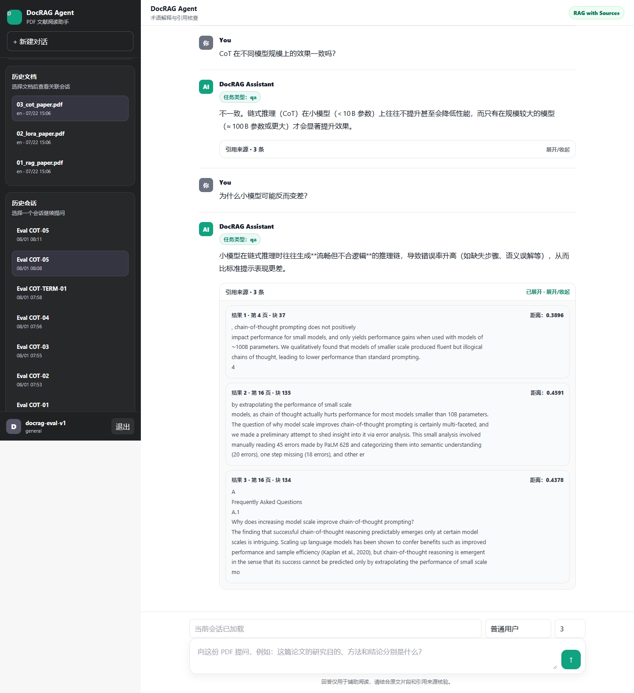
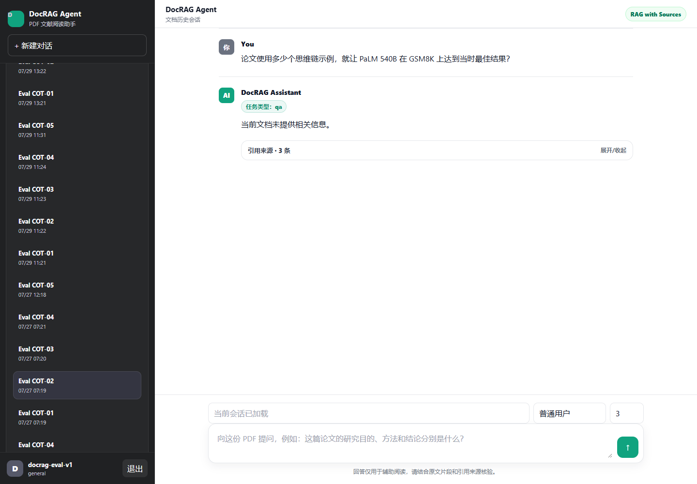
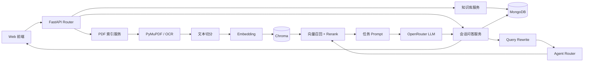

# DocRAG Agent：面向 PDF 文献阅读的 RAG 智能助手

DocRAG Agent 是一个面向学术论文、技术文档、课程资料和项目报告的 PDF 文献阅读助手。系统以检索增强生成（RAG）为主链路，支持文档解析、版本化文本切分、单文档与知识库级多文档检索、重排、多轮问答、引用来源展示和历史会话。

项目重点不是单纯调用大模型，而是实现一条可调试、可评估、可持久化的文档问答流程。系统回答仅用于辅助阅读，重要结论应回到原始文档和引用片段核验。

## 在线演示

- Hugging Face Space：<https://maoxiao-1205-medrag.hf.space/>
- 免费实例可能休眠，首次访问需要等待模型和服务启动。
- 演示环境受免费实例资源和本地磁盘持久性限制，请勿上传敏感文件。

## 项目预览

### 多轮文献问答与引用来源



系统在同一会话中保存用户问题、助手回答和当时使用的 sources。引用片段可展开查看页码、chunk 与检索距离，便于回到原文核验。

### 历史文档与会话管理



文档、会话和消息按用户归属保存。用户可以选择已索引文档、恢复历史会话，也可以基于同一文档新建对话。

## 功能特性

### 文档处理

- 上传 PDF，并使用 PyMuPDF 按页提取文本和页码。
- 通过 `chunk_size`、`chunk_overlap` 切分文本，并保留页码、块序号、文档标识等 metadata。
- 支持 `fixed` 和 `recursive` 两种切片策略，并为切片算法维护显式 `chunk_version`。
- 计算 PDF 内容的 SHA-256 `document_hash`。
- 通过 `user_id + document_hash` 识别同一用户重复上传的相同文件，避免重复解析和索引。
- 根据切片参数、切片版本、Embedding 模型和索引版本生成 `index_fingerprint`；只有指纹一致才复用旧索引。
- `/pdf/index` 支持 `force_reindex=true`，用于忽略旧指纹并强制重建同一 `document_id` 的向量索引。
- 每次重建生成独立 `index_generation_id`，新代次完整写入并验证后才切换 MongoDB 中的 active generation；Dense 与 BM25 检索只读取当前 active 版本。
- 对疑似扫描页支持可选的 Tesseract 中英文 OCR 回退。
- 记录文档主要语言，用于跨语言 Query Rewrite。
- 持久化 `parsing/chunking/embedding/indexing` 处理阶段和失败原因，只有完整写入并校验后才将索引标记为完成。
- Embedding 与 Chroma 写入支持配置化批处理，降低大文档处理时的单批内存和写入压力。

### 检索与生成

- 使用 `BAAI/bge-small-zh-v1.5` 生成文本向量。
- 使用 Chroma 持久化向量，并通过 `user_id + document_id` 过滤检索范围。
- 支持通过 `RETRIEVAL_MODE=dense|hybrid` 切换 Dense 基线与混合检索。
- Hybrid 模式使用 BM25 补充模型名、缩写、数字等精确匹配候选，并通过 RRF 融合 Dense 与 Sparse 排名。
- 支持通过 `EVIDENCE_RERANK_MIN_SCORE` 配置 CrossEncoder 证据阈值；留空时关闭过滤，阈值需使用固定评估集校准。
- 先扩大向量候选池，再使用 `BAAI/bge-reranker-base` 对 `query + chunk` 重排。
- 保存并展示回答对应的 sources，包括页码、chunk 和检索分数。
- 检索无证据时直接拒答，不调用 LLM 基于参数知识补充答案。
- 对 OpenRouter/OpenAI-compatible API 的超时、限流、连接失败和异常状态进行分类处理。

### 知识库与多文档问答

- 一个用户可以创建、重命名和删除多个知识库。
- 文档与知识库使用独立关联记录，同一文档可以加入多个知识库，无需重复生成向量。
- 支持查看知识库文档、移入文档和移出文档。
- 会话可以绑定单个文档，也可以绑定整个知识库。
- 知识库会话可选择部分文档；不选择时检索知识库中的全部文档。
- 多文档检索始终保留 `user_id` 过滤，并使用 `document_id in [...]` 限定知识库范围。
- 各文档候选统一进入 CrossEncoder Rerank，最终 sources 保留文件名、文档 ID、页码和 chunk 信息。

### 用户与多轮会话

- 支持轻量用户创建或选择，并保存默认 `user_type`。
- 文档和会话按 `user_id` 进行逻辑隔离。
- 同一文档可创建多个 conversation，也可继续历史会话。
- user 和 assistant 消息持久化到 MongoDB。
- assistant 消息保存 `sources`、`rewritten_query`、`retrieval_queries` 和 `task_type`。
- 每轮问答读取最近若干条消息作为短期上下文，不无限拼接全部历史。
- Query Rewrite 将含指代的追问改写为可独立检索的问题；失败时回退原始 query。
- `user_type` 支持普通用户、本科生、研究生、科研人员、开发者和教师等回答侧重点。

### 任务路由

当前使用轻量规则 Router：

- 包含“总结、摘要、概括、归纳”时进入 `summary`。
- 包含“阅读报告、分析这篇文献”时进入 `report`。
- 包含“术语、关键词、关键概念”时进入 `term`。
- 包含“依据、出处、引用、来源、证据”时进入 `source_check`。
- 其他问题进入普通 `qa`。

总结任务使用 Summary Multi-Query：根据初始证据生成多个检索子查询，分别召回、重排、去重并控制同页片段数量，再组装总结上下文。`term` 和 `source_check` 使用独立 Prompt，要求回答必须回到 sources。增强流程失败时回退原查询，避免破坏基础问答链路。

## 系统流程

```text
创建或选择用户
  → 创建或选择知识库
  → 上传 PDF，并按需关联知识库
  → 计算 document_hash，检查重复文档
  → PyMuPDF 按页解析，必要时 OCR
  → 文本切分与 metadata 构造
  → Embedding
  → Chroma 向量持久化
  → 创建或恢复单文档/知识库会话
  → 读取最近历史
  → Query Rewrite
  → Agent Router 识别 qa / summary / report / term / source_check
  → 用户与知识库范围校验
  → 单文档或多文档向量召回 + 全局 CrossEncoder Rerank
  → 组装 Prompt
  → 调用 LLM
  → 保存 answer、sources 和检索调试信息
  → 前端展示回答与可折叠引用
```



更完整的模块说明见：

- [项目说明](medrag/docs/项目说明.md)
- [系统架构图](medrag/docs/系统架构图.md)
- [评估集说明](eval/rag_dataset/README.md)

## 技术栈

| 模块 | 技术 |
| --- | --- |
| 后端接口 | Python 3.11、FastAPI、Uvicorn |
| PDF 解析 | PyMuPDF |
| 扫描页 OCR | Tesseract OCR |
| Embedding | Sentence Transformers、`BAAI/bge-small-zh-v1.5` |
| Reranker | CrossEncoder、`BAAI/bge-reranker-base` |
| 向量数据库 | Chroma |
| 业务数据 | MongoDB、PyMongo Async API |
| 大模型 | OpenRouter / OpenAI-compatible API |
| 前端 | HTML、CSS、JavaScript |
| 测试与评估 | pytest、pytest-asyncio、Playwright、自建 RAG 小型评估集 |
| 部署 | Docker、Hugging Face Space |

## 目录结构

```text
MedRag/
├─ medrag/
│  ├─ backend/
│  │  ├─ routers/        # HTTP 参数、响应和状态码
│  │  ├─ services/       # 业务编排、检索、Prompt 和模型调用
│  │  ├─ stores/         # MongoDB 集合读写
│  │  ├─ prompts/        # QA、Summary、Report、Query Rewrite 模板
│  │  ├─ config.py
│  │  ├─ main.py
│  │  ├─ requirements.txt
│  │  └─ .env.example
│  ├─ frontend/
│  │  ├─ index.html
│  │  ├─ app.js
│  │  └─ styles.css
│  └─ docs/
├─ eval/
│  ├─ rag_dataset/       # 评估文档、问题、gold evidence 与结果
│  ├─ run_eval.py
│  ├─ run_follow_up_eval.py
│  ├─ calculate_metrics.py
│  └─ debug_retrieval.py
├─ tests/                # 业务层自动化回归测试
├─ runtime/              # 本地运行数据，不提交 Git
├─ Dockerfile
├─ pytest.ini
├─ requirements-dev.txt
└─ README.md
```

## 核心数据模型

### users

- `user_id`
- `username`
- `default_user_type`
- `created_at`
- `updated_at`

### documents

- `document_id`
- `user_id`
- `document_hash`
- `filename`
- `language`
- `index_fingerprint`
- `index_config`
- `indexed_at`
- `created_at`
- `updated_at`

### knowledge_bases

- `kb_id`
- `user_id`
- `name`
- `description`
- `created_at`
- `updated_at`

### knowledge_base_documents

- `kb_id`
- `user_id`
- `document_id`
- `added_at`

### conversations

- `conversation_id`
- `user_id`
- `document_id`
- `kb_id`
- `selected_document_ids`
- `title`
- `user_type`
- `created_at`
- `updated_at`

### messages

- `message_id`
- `conversation_id`
- `role`
- `content`
- `task_type`
- `rewritten_query`
- `retrieval_queries`
- `sources`
- `created_at`

## 本地运行

### 1. 环境要求

- Python 3.11
- MongoDB
- 可选：Tesseract OCR 及 `eng`、`chi_sim` 语言包

### 2. 安装依赖

```cmd
conda activate medrag
cd /d D:\MedRag\medrag\backend
python -m pip install -r requirements.txt
```

### 3. 配置环境变量

复制配置模板：

```cmd
copy .env.example .env
```

配置示例：

```env
OPENROUTER_API_KEY=your_key
OPENROUTER_BASE_URL=https://openrouter.ai/api/v1
OPENROUTER_MODEL=your_model
RETRIEVAL_MODE=dense
EVIDENCE_RERANK_MIN_SCORE=
EMBEDDING_BATCH_SIZE=32
VECTOR_WRITE_BATCH_SIZE=100
CHROMA_DIR=D:/MedRag/runtime/chroma_db
UPLOAD_DIR=D:/MedRag/runtime/uploads
MONGODB_URI=mongodb://127.0.0.1:27017
MONGODB_DB_NAME=medrag
OCR_ENABLED=false
OCR_LANGUAGES=eng+chi_sim
OCR_DPI=300
OCR_MIN_TEXT_CHARS=20
TESSDATA_PREFIX=D:/Anaconda/envs/medrag/share/tessdata
MAX_UPLOAD_SIZE_MB=20
```

API Key 只能放在后端环境变量中。`.env`、上传文件、Chroma 数据和日志均不得提交到 Git。

### 4. 启动

```cmd
cd /d D:\MedRag\medrag\backend
python -m uvicorn main:app --host 127.0.0.1 --port 8000
```

访问：

- 前端：<http://127.0.0.1:8000/>
- Swagger：<http://127.0.0.1:8000/docs>
- 健康检查：<http://127.0.0.1:8000/health>
- 就绪检查：<http://127.0.0.1:8000/ready>

模型已缓存且 Hugging Face 网络不可用时，可在启动前设置：

```cmd
set HF_HUB_OFFLINE=1
set TRANSFORMERS_OFFLINE=1
```

## 主要接口

| 方法与路径 | 功能 |
| --- | --- |
| `GET /health` | 服务存活检查 |
| `GET /ready` | 检查数据库等关键依赖是否就绪 |
| `POST /users` | 创建或获取轻量用户 |
| `POST /pdf/parse` | 临时解析 PDF 并返回分页文本；响应后删除临时文件，不创建 Document 或索引 |
| `POST /pdf/chunks` | 临时预览切分结果；不写入 MongoDB 或 Chroma |
| `POST /pdf/index` | 去重、解析、版本化切分、向量化并建立索引；支持 `force_reindex` |
| `POST /pdf/search` | 调试指定用户和文档的检索结果 |
| `POST /pdf/prompt-preview` | 预览单轮 RAG Prompt |
| `POST /pdf/answer` | 单轮 RAG 问答兼容接口 |
| `POST /knowledge-bases` | 创建知识库 |
| `GET /knowledge-bases` | 获取当前用户的知识库列表 |
| `GET/PATCH/DELETE /knowledge-bases/{kb_id}` | 查询、修改或删除知识库 |
| `POST/DELETE /knowledge-bases/{kb_id}/documents/{document_id}` | 将文档移入或移出知识库 |
| `GET /knowledge-bases/{kb_id}/documents` | 获取知识库文档列表 |
| `POST /conversations` | 创建单文档或知识库会话 |
| `GET /conversations` | 按用户、文档或知识库获取会话列表 |
| `GET /conversations/{id}/messages` | 校验用户归属并获取历史消息 |
| `POST /conversations/{id}/ask` | 执行多轮 Query Rewrite、检索和回答 |

请求与响应的完整字段以 Swagger 为准。

## 自动化测试

安装开发依赖：

```cmd
cd /d D:\MedRag
D:\Anaconda\envs\medrag\python.exe -m pip install -r requirements-dev.txt
```

运行：

```cmd
D:\Anaconda\envs\medrag\python.exe -m pytest -q
```

当前自动化回归测试覆盖：

- 不指定文档时查询用户全部会话。
- 拒绝空 `document_id`。
- 同一用户和相同 `document_hash` 复用已有文档。
- Query Rewrite 调用失败时回退原问题。
- assistant 消息保存 sources。
- 前端 Playwright smoke 覆盖创建用户、上传索引、重复上传、历史会话、追问和 sources 展示。
- 前端静态回归检查 `indexPdf()` 不会在创建会话前读取 `conversation.user_type`。
- 知识库 CRUD、用户归属校验和文档关联幂等性。
- 整个知识库与指定文档范围的多文档检索。
- Chroma `user_id + document_id $in` 过滤和跨文档全局 Rerank。
- 前端知识库创建、文档关联、知识库会话和 sources 文件名展示。

当前全量工程测试基线：

```text
154 passed
```

测试包含业务单元测试、接口契约测试和前端 smoke test。大量外部依赖通过 Mock 隔离，因此不能替代 MongoDB、Chroma、真实模型和完整接口的集成测试。

## RAG 评估

评估集包含 3 篇公开论文、19 道问题，覆盖事实、术语、对比、总结、无答案、多轮追问和证据核查。

```cmd
cd /d D:\MedRag
python eval\rag_dataset\validate_dataset.py
python eval\run_eval.py
python eval\run_follow_up_eval.py
python eval\calculate_metrics.py
```

当前仓库保存的基线结果：

| 指标 | 数值 |
| --- | ---: |
| Execution Success Rate | 0.8421 |
| HitRate@3 | 0.7692 |
| Recall@3 | 0.6026 |
| MRR@3 | 0.6410 |

本轮 16 道非追问题全部执行成功；3 道 follow-up 在连续评估后被免费模型供应商限流并返回 503，因此执行成功率下降不能直接归因于 Query Rewrite。检索 bad case 主要集中在 `LORA-03`、`COT-03`、`COT-TERM-01`，`LORA-01` 只覆盖部分 gold evidence。新增 `source_check` 两题的 HitRate@3 为 1.0、Recall@3 为 0.8333，但样本数很小，只能作为回归基线。

## 关键工程问题与处理

### CORS 导致前端 `Failed to fetch`

前后端分别运行在不同端口时属于不同 Origin，浏览器会执行同源策略。后端通过 FastAPI `CORSMiddleware` 显式允许开发前端来源；正式部署时由 FastAPI 同源托管静态前端，减少跨域配置差异。

### Chroma HNSW 索引损坏

旧 Chroma 持久化目录曾在删除文档向量时出现 `Error loading hnsw index`。处理时保留损坏目录用于排查，创建新的项目级持久化目录并重新索引；配置统一使用 `CHROMA_DIR`，避免数据散落到系统盘。当前重新索引使用独立 generation 写入，验证完成后切换 active generation；失败代次会被清理，旧 active 版本不会在写入开始前删除。

### Query Rewrite 偏离或失败

追问中的“它、该方法、另一个变体”直接检索容易丢失主题。系统读取最近几轮历史补全指代，并保存 `original_query`、`rewritten_query` 和 `retrieval_queries` 便于复现。改写失败时回退原问题，避免增强模块阻断主链路；原问题仍用于前端展示和消息存储。

### Summary 单次召回覆盖不足

总结问题的证据通常分散在多个页面，单次 top-k 容易只命中一个局部。Summary Multi-Query 先生成多个检索子问题，再分别召回、Rerank、去重并限制同页 chunk 数量，从而扩大证据覆盖。优化效果必须通过固定评估集比较 HitRate、Recall、MRR、引用准确性和延迟，不能只看回答是否流畅。

## 工程边界

- 当前是轻量用户模式，`user_id` 由前端保存并传入，不等同于密码登录、Session 或 JWT 鉴权。
- `user_id + document_id` 用于资源归属和逻辑隔离，但客户端仍可能伪造 `user_id`。
- OCR 只解决扫描页文字提取；复杂表格、公式、图表语义和普通图片尚未接入视觉模型。
- Chroma 使用本地文件持久化，免费云实例重启后可能丢失索引。
- `/health` 当前属于存活检查，不验证 MongoDB、Chroma、模型和 LLM 供应商的可用性。
- 当前评估集规模较小，适合回归和基线比较，不代表生产环境效果。
- 知识库删除涉及 MongoDB 多个集合，目前没有事务保证跨集合原子性。
- `/pdf/search` 调试接口仍以单文档为主，多文档问答通过 conversation 主链路执行。
- 多文档工程链路已经完成，但尚未形成固定的多文档检索效果基线。
- 现阶段仍缺少真实鉴权、完整监控指标、并发测试和容量测试。

## 后续计划

1. 固定多文档评估集，验证整库检索、部分文档检索、跨文档比较和越权隔离。
2. 分析多文档候选覆盖、全局 Rerank 排名、引用准确性和延迟，形成可复现基线。
3. 在基线稳定后实现 Hybrid Retrieval，引入 BM25、RRF、候选去重和证据阈值。
4. 补充 MongoDB/Chroma 真实集成测试、结构化日志、请求级追踪和依赖 readiness。
5. 达到实际容量瓶颈后再通过 benchmark 决定是否从 Chroma 迁移到 Qdrant 或 Milvus。

## 项目声明

本项目是面向 PDF 文献检索与辅助阅读的实验性系统。系统生成内容不构成医学、法律、投资或其他专业建议；重要结论应结合原始文档和引用来源核验。
