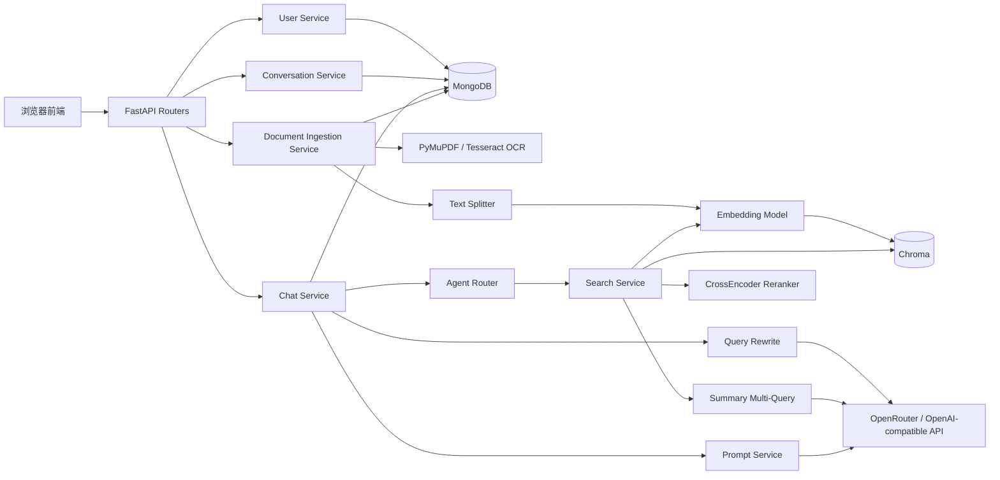
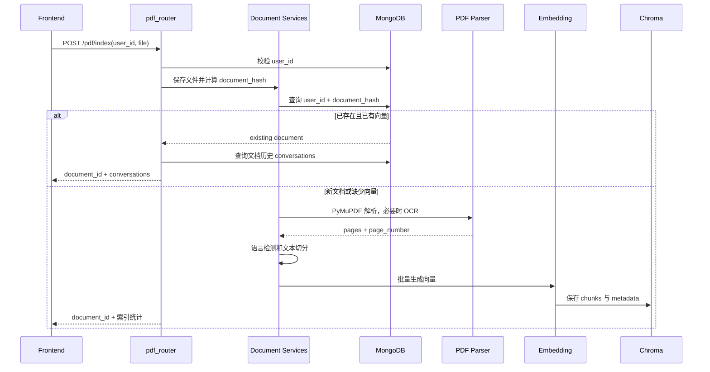
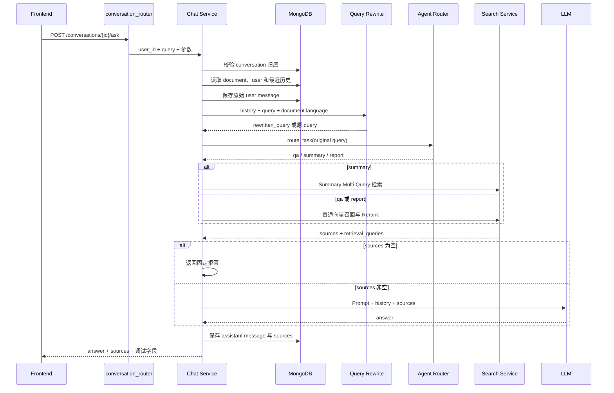

# DocRAG Agent 系统架构

## 1. 总体架构



## 2. 分层边界

```text
Frontend
  └─ 负责交互、状态展示和调用 HTTP API

Routers
  └─ 接收参数、调用 Service、转换 HTTP 错误、返回响应

Services
  └─ 业务规则、流程编排、检索、Prompt、模型调用

Stores
  └─ MongoDB 连接、集合查询、写入和索引

External Dependencies
  ├─ MongoDB：用户、文档、会话和消息
  ├─ Chroma：chunk、向量和 metadata
  ├─ Sentence Transformers：Embedding 和 Reranker
  ├─ OpenRouter：Query Rewrite、Summary Query 和回答生成
  └─ Tesseract：扫描页 OCR
```

## 3. PDF 索引链路



关键约束：

- `document_hash` 用于重复文件识别。
- `document_id` 用于后续文档资源引用。
- 同一文件对不同用户仍是不同 documents 记录。
- Chroma metadata 同时保存 `user_id` 和 `document_id`。

## 4. 多轮问答链路



## 5. 普通检索链路

```text
rewritten_query
  → BGE query embedding
  → Chroma 按 user_id + document_id 过滤
  → 召回 n_results × 5 个候选
  → 过滤版权声明等低价值片段
  → CrossEncoder(query, chunk) 重排
  → 返回最终 n_results
```

诊断顺序：

1. 正确证据未进入候选池：检查 Query Rewrite、语言、Embedding、切分和候选数。
2. 候选池中存在但最终 top-k 丢失：检查 Reranker、过滤和去重。
3. sources 正确但回答错误：检查 Prompt、上下文组织和 LLM 忠实性。

## 6. Summary Multi-Query 链路

```text
summary query
  → 召回并重排 seed sources
  → LLM 基于 seed sources 生成最多 4 个子查询
  → 原问题 + 子查询去重
  → 每个子查询独立召回
  → 每个子查询独立 Rerank 并保留前若干条
  → 按 document_id + chunk_index 合并
  → 使用原问题统一 Rerank
  → 每页最多保留 2 个 chunk
  → 最多保留 12 个 sources
```

该流程提高总结题对分散证据的覆盖，但会增加 LLM 调用、检索次数、Rerank 成本和上下文噪声，因此必须通过评估集验证，而不能只依赖单次展示结果。

## 7. 模块职责

### Routers

| 文件 | 责任 |
| --- | --- |
| `routers/user_router.py` | 创建或获取轻量用户 |
| `routers/pdf_router.py` | PDF 解析、切分、索引、检索调试和单轮兼容接口 |
| `routers/conversation_router.py` | 会话创建、列表、历史消息和多轮问答 |

### Services

| 文件 | 责任 |
| --- | --- |
| `user_service.py` | 用户校验、创建和响应格式 |
| `document_service.py` | 文档登记、重复识别和语言字段 |
| `document_ingestion_service.py` | 上传、文档登记和解析编排 |
| `pdf_storage_service.py` | PDF 校验、读取、hash 和落盘 |
| `pdf_parser_service.py` | PyMuPDF 解析与 OCR 回退 |
| `text_splitter_service.py` | chunk 切分和 metadata |
| `embedding_service.py` | 文本和查询向量 |
| `vector_store_service.py` | Chroma 读写和过滤 |
| `rerank_service.py` | CrossEncoder 重排 |
| `search_service.py` | 普通检索和 Summary Multi-Query 编排 |
| `summary_query_service.py` | 总结子查询生成和失败回退 |
| `query_rewrite_service.py` | 多轮指代补全、语言转换和失败回退 |
| `agent_router_service.py` | qa、summary、report 规则路由 |
| `prompt_service.py` | QA、Summary、Report Prompt 组装 |
| `llm_service.py` | LLM 客户端、异常分类和日志 |
| `conversation_service.py` | 会话创建、归属校验和查询 |
| `message_service.py` | 消息保存、历史读取和 sources 持久化 |
| `chat_service.py` | 完整多轮问答流程编排 |

### Stores

| 文件 | 责任 |
| --- | --- |
| `stores/database.py` | MongoDB 连接和关闭 |
| `stores/user_store.py` | users 集合读写与索引 |
| `stores/document_store.py` | documents 集合读写与唯一索引 |
| `stores/conversation_store.py` | conversations 查询、排序和更新时间 |
| `stores/message_store.py` | messages 顺序查询和最近消息读取 |

## 8. 数据存储边界

```text
MongoDB
  ├─ users
  ├─ documents
  ├─ conversations
  └─ messages

Chroma
  └─ chunks + embeddings + metadata

Filesystem
  └─ uploaded PDF + Chroma persistence files + model cache
```

MongoDB 适合结构化业务数据和历史消息；Chroma 负责向量相似度检索。二者不能互相替代。

## 9. 当前工程风险

- 前端传入的 `user_id` 不是可信登录身份。
- user message 和 assistant message 分别写入，不具备跨步骤事务原子性。
- 免费部署环境中的本地向量文件可能随实例重启丢失。
- OCR、Embedding、Rerank 属于 CPU 密集型任务，尚未完成并发容量验证。
- `/health` 只检查应用存活，尚未覆盖 MongoDB、Chroma 和模型 readiness。
- Summary Multi-Query 增加覆盖率的同时可能降低 Context Precision。
